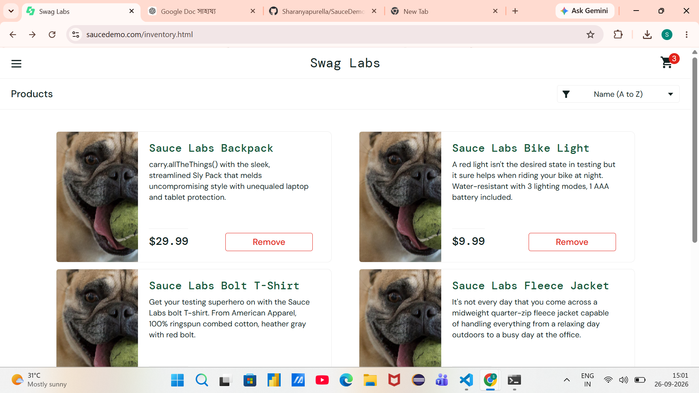
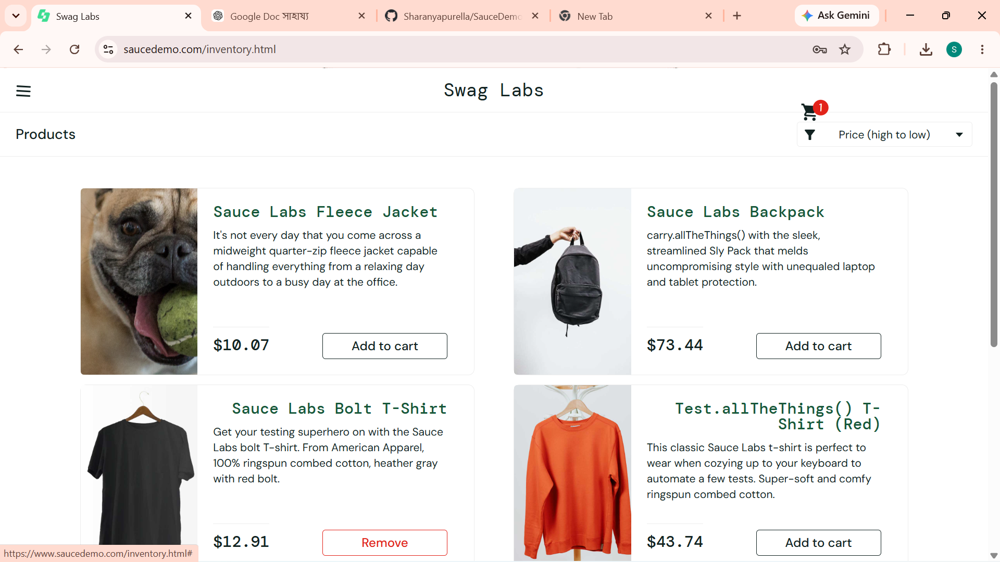
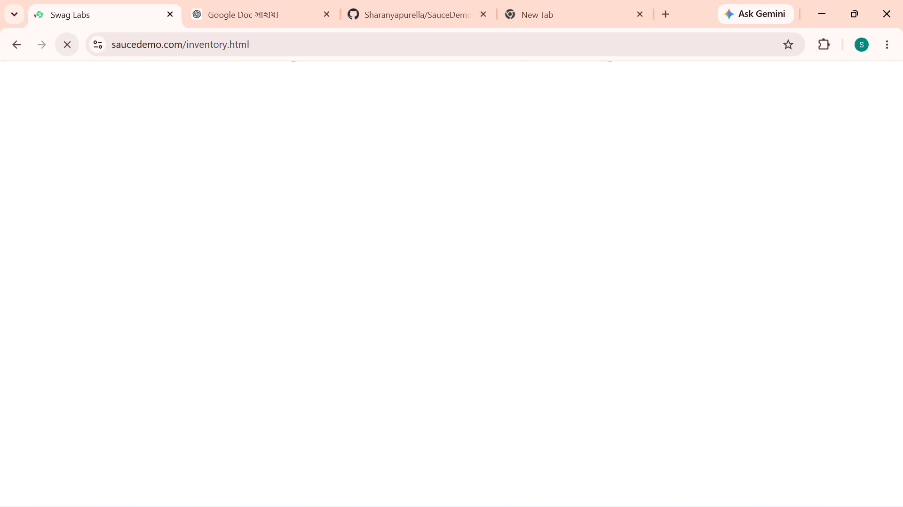
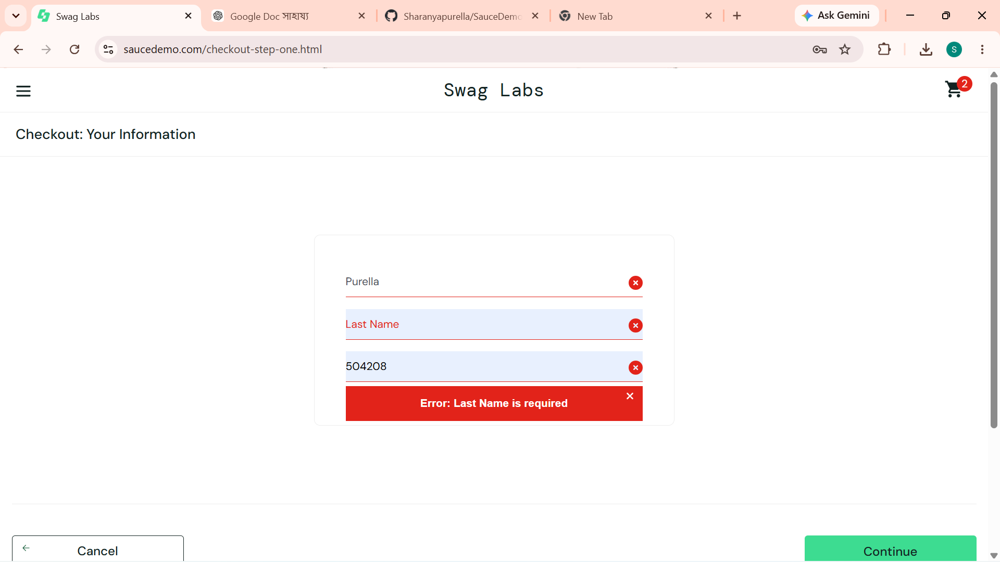

# SauceDemo Bug Report

Website:https://www.saucedemo.com/

Tester: Sharanya Purella

Testing Type: Manual Testing
## BUG-001: Incorrect Product Images

**Severity:** Medium

**User:** problem_user

**Precondition:**
Login using problem_user with the correct password.

**Steps to Reproduce:**
1. Open SauceDemo.
2. Login using problem_user.
3. Open the Products page.
4. Check the product images.

**Expected Result:**
Each product should display its corresponding product image.

**Actual Result:**
Multiple products display the same incorrect product image.

**Impact:**
Users may have difficulty identifying products correctly.

**Screenshot:**

## BUG-002: Remove Button Does Not Change Back to Add to Cart

**Severity:** Medium

**User:** problem_user

**Precondition:**
Login using problem_user with the correct password.

**Steps to Reproduce:**
1. Open SauceDemo.
2. Login using problem_user.
3. Select a product.
4. Click the Add to cart button.
5. Click the Remove button for the product.
6. Check the product button again.

**Expected Result:**
After removing the product from the cart, the button should change back to "Add to cart".

**Actual Result:**
After clicking Remove, the button does not change back to "Add to cart".

**Impact:**
The user may not be able to add the product to the cart again as expected.

**Screenshot:**

## BUG-003: Product Sorting Failure

**Severity:** Medium

**User:** performance_glitch_user

**Precondition:**
Login using performance_glitch_user with the correct password.

**Steps to Reproduce:**
1. Open SauceDemo.
2. Login using performance_glitch_user.
3. Go to the Products page.
4. Open the product sorting dropdown.
5. Select a sorting option such as "Price (high to low)".
6. Check the order of the products.

**Expected Result:**
Products should be displayed in the selected sorting order.

**Actual Result:**
The products were not displayed in the expected sorting order. An error message related to sorting was also displayed.

**Impact:**
Users may have difficulty finding products according to their preferred sorting option.

**Screenshot:**
![BUG-003](screenshots/BUG
  

  ## BUG-004: Slow Page Loading

**Severity:** Medium

**User:** performance_glitch_user

**Precondition:**
Login using performance_glitch_user with the correct password.

**Steps to Reproduce:**
1. Open SauceDemo.
2. Login using performance_glitch_user.
3. Navigate through the Products page.
4. Observe the page loading behavior.

**Expected Result:**
The Products page and its contents should load within a reasonable time without noticeable delays.

**Actual Result:**
The Products page took noticeably longer to load during testing.

**Impact:**
Slow loading may affect the user experience and make the application feel unresponsive.

**Screenshot:**

## BUG-005: Last Name Field Does Not Accept Input

**Severity:** High

**User:** problem_user

**Precondition:**
Login using problem_user with the correct password and add a product to the cart.

**Steps to Reproduce:**
1. Open SauceDemo.
2. Login using problem_user.
3. Add a product to the cart.
4. Open the cart.
5. Click Checkout.
6. Enter the First Name.
7. Try to enter a value in the Last Name field.
8. Click Continue.

**Expected Result:**
The Last Name field should accept the entered value and allow the user to continue when all required information is provided.

**Actual Result:**
The Last Name field did not accept the entered value. The checkout displayed an error indicating that the Last Name was required.

**Impact:**
The user may be unable to proceed with the checkout process.

**Screenshot:**
